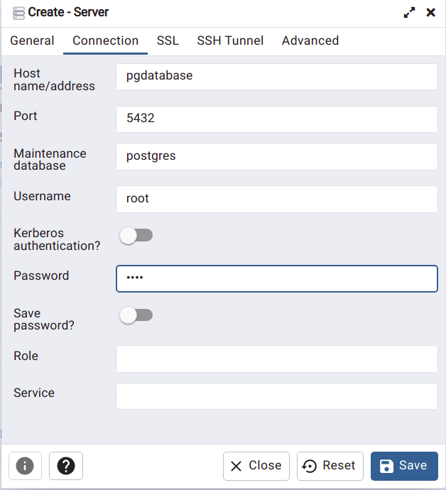

<!-- services:
  postgres:
    image: postgres:13
    environment:
      POSTGRES_USER: airflow
      POSTGRES_PASSWORD: airflow
      POSTGRES_DB: airflow
    volumes:
      - postgres-db-volume:/var/lib/postgresql/data
    healthcheck:
      test: ["CMD", "pg_isready", "-U", "airflow"]
      interval: 5s
      retries: 5 -->

**Create Docker with Postgresql**

```bash
docker run -it \
-e POSTGRES_USER="root" \
-e POSTGRES_PASSWORD="root" \
-e POSTGRES_DB="newyorktaxi" \
-v /home/edward/Documents/Self-learn/dataengg/data-engineering-zoomcamp/week_1_basics_n_setup/practice/nytaxipostgres:/var/lib/postgresql/data \
-p 5431:5432 \
postgres:13
```

**if the volume folder seem hidden/inacessable, then run the following command to view contents of the folder**  
```bash
sudo chmod a+rwx nytaxipostgres
```

**for interactive postgres in bash**  
```
pgcli -h <hostname> -p <port number> -d <database name> -u <username> -p <password>
```

**Dataset link**
https://www1.nyc.gov/site/tlc/about/tlc-trip-record-data.page

**Dataset Description**  
https://www1.nyc.gov/assets/tlc/downloads/pdf/data_dictionary_trip_records_yellow.pdf

**Create pgAdmin4 docker image**
```bash
docker run -it \
-e PGADMIN_DEFAULT_EMAIL="admin@admin.com" \
-e PGADMIN_DEFAULT_PASSWORD="root" \
-p 8080:80 \
dpage/pgadmin4
```

**Creating a network to connect two dockers where one is having postgres and another is having pgadmin GUI**

```bash
docker network create <network name>
```


## Connect two dockers by adding network name and  option in both dockers:

**introducing network in postgres for connection**  

--network -> network which used to connect, --name is important in postgres

```bash
docker run -it \
-e POSTGRES_USER="root" \
-e POSTGRES_PASSWORD="root" \
-e POSTGRES_DB="newyorktaxi" \
-v /home/edward/Documents/Self-learn/dataengg/data-engineering-zoomcamp/week_1_basics_n_setup/practice/nytaxipostgres:/var/lib/postgresql/data \
-p 5431:5432 \
--network=pg-network \
--name pgdatabase \
postgres:13
```

**introducing network in pgAdmin4 for connection**


```bash
docker run -it \
-e PGADMIN_DEFAULT_EMAIL="admin@admin.com" \
-e PGADMIN_DEFAULT_PASSWORD="root" \
-p 8080:80 \
--network=pg-network \
--name pgadmin \
dpage/pgadmin4
```


